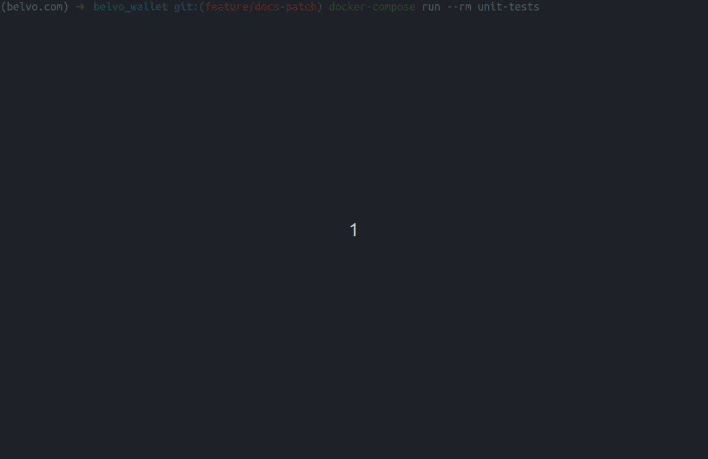

# belvo_wallet
A very simple REST API that stores financial transactions made by each user, summarizes spending, and receivables and accounts transaction balances by category. 

This project is part of the technical test performed for Belvo company on the position of Backend Engineer - Mid Level position.

## Installation
> This installation mode is the most indicated when the goal is to run in production mode.
> If you want to install without docker, directly in your machine please read the topic: [Extra: Working in your local machine (without docker)](#extra-working-in-your-local-machine-without-docker)

Before you can execute the installing commands, please ensure these external requirements are already installed:
- [Docker](https://docs.docker.com/engine/install/)
- [docker-compose](https://docs.docker.com/compose/install/)


To run this app on Docker containers, please execute the commands below:
```shell
# clone this repository
git clone git@github.com:samukasmk/belvo_wallet.git

# access new folder
cd belvo_wallet

# build and run the apps inside containers
docker-compose up --build -d
```

**Example:**

 

## Using the REST API
After `docker-compose` has created the new containers you can access them directly by URL: [http://127.0.0.1/transactions/](http://127.0.0.1/transactions/)

from your preferred HTTP client like `chrome browser`, `postman`, `curl`, `python requests`, or others.

If you prefer, I've documented the API endpoints with Swagger and OpenAPI 3.

To access the API documentation you just need click on root URL of Django project like:
[http://127.0.0.1](http://127.0.0.1)
and the system will redirect to the Swagger url at:
[http://127.0.0.1/api/docs](http://127.0.0.1/api/docs)

> But don't forget to create and run the containers with `docker-compose up` command before access the mentioned URLs

**Example:**

 

---

As requested in test description, I created 4 endpoint variations of `/transactions` verb to:
- create many transactions in bulk mode: `POST /transactions`
- list all existing transactions: `GET /transactions`
- summarize transactions by total inflows and outflows per user: `GET /transactions?group_by=type`
- summarize transactions grouped by category: `GET /transactions/{user_email}/summary`

I also created, in addition 4 more new endpoints variations of `/transaction` verb to:
- create a new single transaction record: `POST /transaction`
- retrieve a transaction record by reference id: `GET /transaction/{reference}`
- update transaction fields information: `PUT /transaction/{reference}`
- and deleting it: `DELETE /transaction/{reference}`

## Multiple transactions endpoints 
### Create many transactions in bulk mode
```
POST /transactions
```
**Example:**


### List all existing transactions
```
GET /transactions
```
**Example:**


### Summarize transactions by total inflows and outflows per user
```
GET /transactions?group_by=type
```

**Example:**


### Summarize transactions grouped by category
```
GET /transactions/{user_email}/summary
```

**Example:**


## Specific transaction endpoints
### Create a new single transaction record
```
POST /transaction
```

**Example:**


### Retrieve a transaction record by reference id
```
GET /transaction/{reference}
```

**Example:**


### Update transaction fields information
```
PUT /transaction/{reference}
```

**Example:**


### And deleting it
```
DELETE /transaction/{reference}
```

**Example:**


## Running unit tests (from docker container)
Since `docker-compose` has built with success the image containers
you can run the `unit tests` directly from `docker-compose` with the command: 

```shell
docker-compose run --rm unit-tests
```

**Example:**



> Note: I covered as much as possible in terms of time, the variants of test scenarios,
> reaching the coverage level of 100%, but many tests can be improved in terms of
> performance, simplicity, and even cover unforeseen scenarios by coverage tool
> because I wrote them as quickly as possible in the time of I had


# Extra: Working in your local machine (without docker)  

## Installing in your local machine
> This installation mode is a very specific implementation to install **(without Docker)** for development purposes like debugging this app in your IDE.
> **If you want to run with Docker, please ignore the instructions below returning to the topic of [Installation](#installation).**

To run this Django project in your local machine, execute the commands below:
```shell
# clone this repository
git clone https://github.com/samukasmk/belvo_wallet.git

# access new folder
cd belvo_wallet

# create new virtualenv
python3 -m venv ./venv
source ./venv/bin/activate

# install required libraries
pip install -r requirements.txt

# export the static files
./manage.py collectstatic

# create the database structure
./manage.py migrate

# run the webserver
./manage.py runserver
```

## Running unit tests (without docker container)
```shell
make test

# or your run pytest directly from your IDE like
pytest .
```